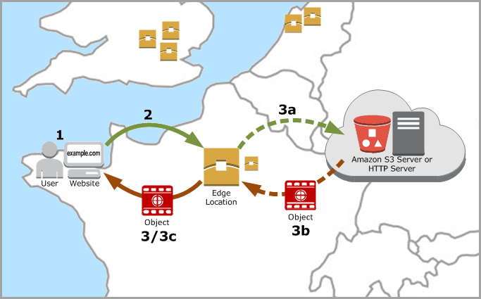

# Introduction

### What is Content Delivery Network?

Content Delivery Network (CDN) is a globally-distributed network of caching servers called Edge Locations that are spread around the world. **Amazon CloudFront** service is the AWS CDN.

### Why should you use it?

CDN accelerates the downloading of content. It uses Domain Name System (DNS) geolocation to determine the geographic location of each request for content. The content is served from caching servers closest to that location. Reduced load on an original website results in better website performance, better end-user experience.

### What is Distribution Origin?

To use Amazon CloudFront, you start by creating a distribution. A place from a distribution downloads content is called a distribution origin. It can be an HTTP server or as in our case Amazon S3 bucket.

### What are Amazon S3 and S3 bucket?

Amazon Simple Storage Service is object storage that stores data as objects within buckets. An object is a file and any metadata that describes that file. A bucket is a container for objects. Its name has to be globally unique.

### What is Amazon Route 53?

Amazon Route 53 is the AWS Domain Name Server service.

After making changes in DNS servers changes are not immediately available, they need time to propagate! You can check DNS propagation [here](https://dnschecker.org/#NS).

### What is AWS Certificate Manager?

AWS Certificate Manager is a service you can use to provision, manage and deploy SSL/TLS certificates for use with AWS services.

### What are we going to do today?

